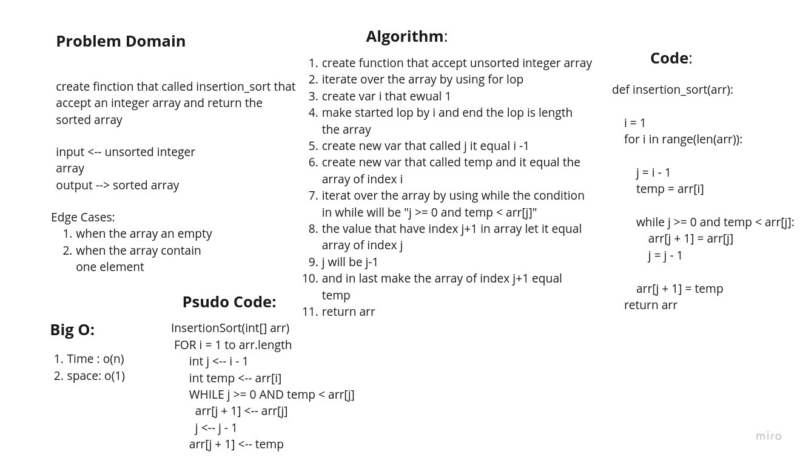

# Challenge Summary
<!-- Description of the challenge -->
trace the algorithm by stepping through the process with the provided sample array. Document your explanation by creating a blog article that shows the step-by-step output after each iteration through some sort of visual.

her the [**Blog**](../insertion_sort/BLOG.md) that descripe how the function work

## Whiteboard Process
<!-- Embedded whiteboard image -->

## Approach & Efficiency
<!-- What approach did you take? Why? What is the Big O space/time for this approach? -->

create finction that called insertion_sort that
accept an integer array and return the sorted array

## Solution
<!-- Show how to run your code, and examples of it in action -->

create function that accept unsorted integer array
iterate over the array by using for lop
create var i that ewual 1
make started lop by i and end the lop is length the array
create new var that called j it equal i -1
create new var that called temp and it equal the array of index i
iterat over the array by using while the condition in while will be "j >= 0 and temp < arr[j]"
the value that have index j+1 in array let it equal array of index j
j will be j-1
and in last make the array of index j+1 equal temp
return arr