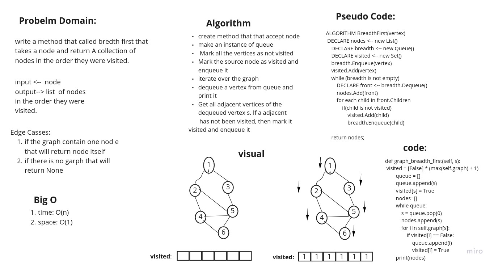

# Challenge Summary
<!-- Description of the challenge -->
Breadth-First-graph: is similar on tree
it dependent on enqueue and dequeue the root node.

## Whiteboard Process
<!-- Embedded whiteboard image -->

## Approach & Efficiency
<!-- What approach did you take? Why? What is the Big O space/time for this approach? -->
Big O: 
space: O(1)
time: O(n)

## Solution
<!-- Show how to run your code, and examples of it in action -->

create method that that accept node
make an instance of queue

Mark all the vertices as not visited

Mark the source node as visited and enqueue it

iterate over the graph
dequeue a vertex from queue and print it
Get all adjacent vertices of the dequeued vertex s.

If a adjacent has not been visited, then mark itvisited and enqueue it