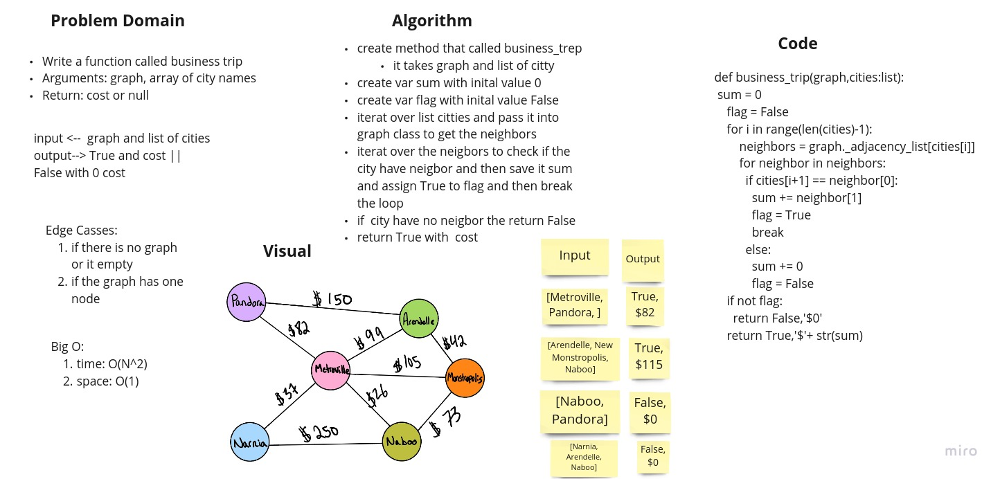

# Challenge Summary
<!-- Description of the challenge -->
Write a function called business trip
Arguments: graph, array of city names
Return: cost or null

## Whiteboard Process
<!-- Embedded whiteboard image -->

## Approach & Efficiency
<!-- What approach did you take? Why? What is the Big O space/time for this approach? -->

Big O:
1. time : O(n^2)
2. space : O(1)

## Solution
<!-- Show how to run your code, and examples of it in action -->
1. create method that called business_trep
it takes graph and list of citty
2. create var sum with inital value 0
3. create var flag with inital value False
4. iterat over list citties and pass it into graph class to get the neighbors
5. iterat over the neigbors to check if the city have neigbor and then save it sum and assign True to flag and then break the loop
6. if  city have no neigbor the return False
7. return True with  cost