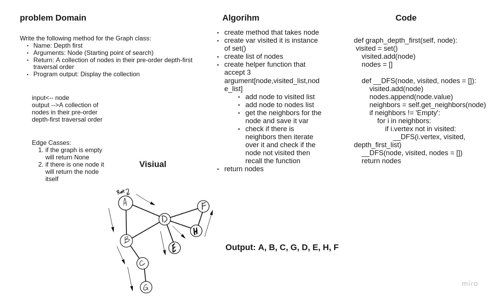

# Depth First Traversal
<!-- Short summary or background information -->
Depth-first search (DFS) is an algorithm for searching a graph or tree data structure. The algorithm starts at the root (top) node of a tree and goes as far as it can down a given branch (path), then backtracks until it finds an unexplored path, and then explores it.

## Challenge
<!-- Description of the challenge -->
Write the following method for the Graph class:

* Name: Depth first
* Arguments: Node (Starting point of search)
* Return: A collection of nodes in their pre-order depth-first traversal order
* Program output: Display the collection

## Approach & Efficiency
<!-- What approach did you take? Why? What is the Big O space/time for this approach? -->

## Solution
<!-- Embedded whiteboard image -->

It descripeed in Whiteboard
