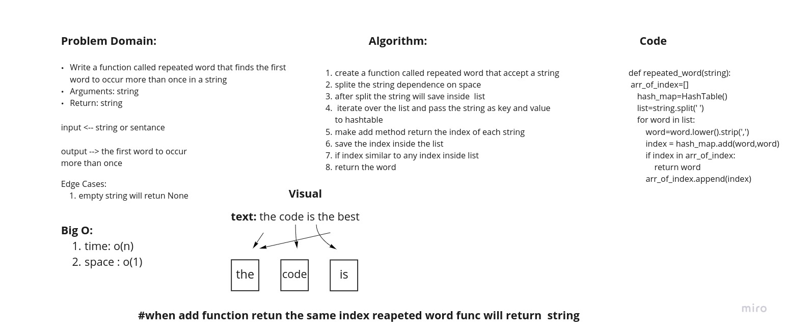

# Challenge Summary
<!-- Description of the challenge -->

Write a function called repeated word that finds the first word to occur more than once in a string:

* Arguments: string
* Return: string

pull request: 
## Whiteboard Process
<!-- Embedded whiteboard image -->

## Approach & Efficiency
<!-- What approach did you take? Why? What is the Big O space/time for this approach? -->

I use hash table to implement this challenge

## Solution
<!-- Show how to run your code, and examples of it in action -->

* create a function called repeated word that accept a string
* splite the string dependence on space
* after split the string will save inside  list
iterate over the list and pass the string as key and value to hashtable
* make add method return the index of each string
* save the index inside the list
* if index similar to any index inside list
* return the word