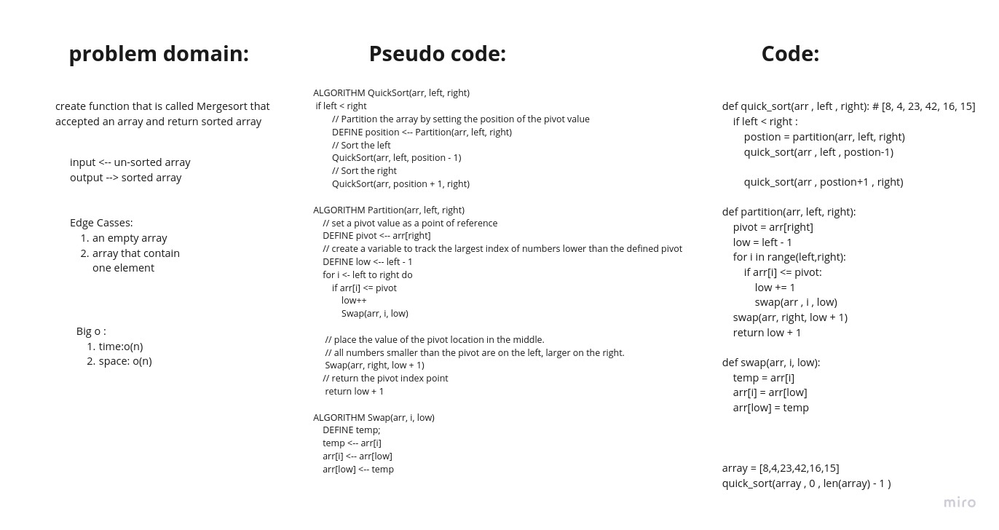

# Challenge Summary
<!-- Description of the challenge -->
trace the algorithm by stepping through the process with the provided sample array. Document your explanation by creating a blog article that shows the step-by-step output after each iteration through some sort of visual.

her the [**Blog**](../quick_sort/BLOG.md) that descripe how the function work

## Whiteboard Process
<!-- Embedded whiteboard image -->

## Approach & Efficiency
<!-- What approach did you take? Why? What is the Big O space/time for this approach? -->

create function that is called quick sort that
accepted an array and return sorted array

## Solution
<!-- Show how to run your code, and examples of it in action -->

1. create function that is accept an array
2. declare var the equal length the array
3. finding the mid of the array and save it in new var
4. Dividing the array elements  into 2 halves [left and reight]
5. Sorting the first half by recursion the same function
6. Sorting the second half by recursionthe same function
7. create another function that accept left, reght and array
8. Sortingdeclare three var that are equal zero
9. declare Copy data to temp arrays left[] and reght[]
10. Checking if any element was left or reght