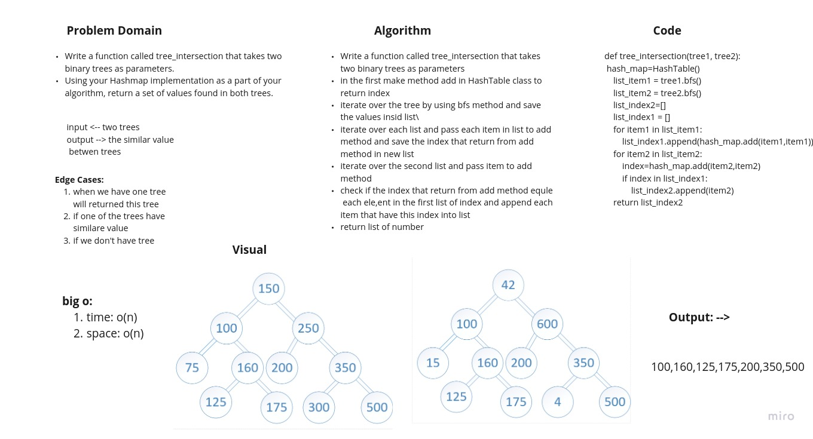

# Challenge Summary
<!-- Description of the challenge -->

Write a function called tree_intersection that takes two binary trees as parameters.
Using your Hashmap implementation as a part of your algorithm, return a set of values found in both trees.

**Pull req:** https://github.com/adhammhaydat/data-structures-and-algorithms401/pull/5

## Whiteboard Process
<!-- Embedded whiteboard image -->

## Approach & Efficiency
<!-- What approach did you take? Why? What is the Big O space/time for this approach? -->
Big O:
1. time: O(n)
2. space: O(n)

## Solution

1. Write a function called tree_intersection that takes two binary trees as parameters.
2. in the first make method add in HashTable class to return index.
3. iterate over the tree by using bfs method and save the values insid list.
4. iterate over each list and pass each item in list to add method and save the index that return from add method in new list.
5. iterate over the second list and pass item to add method.
6. check if the index that return from add method equle  each element in the first list of index and append each item that have this index into list.
7. return list of number.
